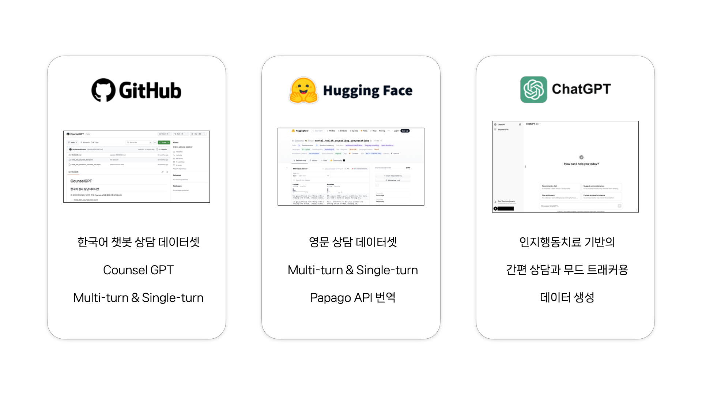

# 마인드벗

<h3>23-2 YBIGTA 컨퍼런스</h3>

인지행동치료(CBT) 기반의 심리 상담 보조 서비스 프로젝트

   

## 목차
- [문제 정의](#문제-정의)
- [세부 목표](#세부-목표)
- [접근 방법](#접근-방법)
- [주요 기능](#주요-기능)
- [팀 구성](#팀-구성)

## 문제 정의

대한민국의 우울증 평생 유병률은 약 36.8%로 OECD 국가 중 1위이다. 즉 3명 중 1명이 일생 중 최소 한 번은 우울증을 앓는다는 뜻이다. 특히 국내 성인 8명 중 1명은 중증 우울증을 경험한다고 한다. 이에 반해 정신장애 진단 후 전문가 상담 및 우울증 치료 비율은 약 10%로 OECD 최저 수준이다.

현상에 대한 주요 원인으로는 **비싼 진료/상담 가격, 사회적 편견 및 시공간적 제약으로 인한 접근성 부족**을 꼽을 수 있다. 이를 해결하기 위해 **인지 행동 치료(CBT) 기반 챗봇**을 만들어 기존의 비용, 프라이버시, 접근성 허들을 해결하고자 한다.

## 세부 목표

인지 행동 치료란?
- 심리적인 문제에 기여하는 감정, 생각(인지), 행동 사이에는 밀접한 관련이 있음.
- 환자 스스로 생각(인지)를 조절해 문제 본질을 파악하고 해결하는 훈련이 가능하도록 도움을 주는 전문 심리치료 방법

따라서 아래와 같은 세부적인 특성들을 포함하는 챗봇을 개발하는 것을 목표로 함.

## 접근 방법

1. **주요 태스크**
    - 간편 상담
        - 유저의 설문 데이터 기반으로, 인지 행동 치료에 기반한 상담을 제공
    - 무드 트래킹
        - 유저가 현재 느끼는 정서의 정도 및 이유를 기반으로 간단한 상담 및 조언 제공

2. **데이터셋**
    
    기존 데이터셋은 인지 행동 치료 기반이 아니고 유저 맞춤형 정보를 반영하지 못함. 따라서 Automatic Prompt Engineering, In-context Few-shot Learning을 활용하여 모델에 학습시킬 데이터셋을 직접 생성

    

3. **모델링**

    복잡한 상담 이슈를 구현하기 위해 총 네 종류의 모델을 적절히 엮어 활용한다.
    
    

4. **플로우 & 아키텍쳐**

    

    

## 주요 기능

1. **사용자 설문**

    

2. **무드 트래킹 & 간편 상담**

    

## Team Members

|이름|팀|역할|
|-|-|-|
|**[정경윤](https://github.com/jkyoon2)**|DS|총괄/기획/데이터셋/모델링|
|**[임종혁](https://github.com/may24th2000)**|DE|모델링/발표자료|
|**[오재현](https://github.com/OhtoEncoder)**|DE|모델링|
|**김하영**|DA|기획/디자인/프런트|
|**[유지민](https://github.com/yxxjimin)**|DE|프런트|
|**[이우흥](https://github.com/hengyinayo)**|DE|백엔드|
|**[오동하](https://github.com/Oh-dongha)**|DA|기획/백엔드|

