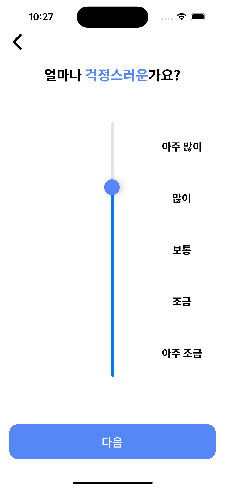

# 마인드벗
**23-2 YBIGTA 컨퍼런스**

인지행동치료(CBT) 기반의 심리 상담 보조 서비스 프로젝트

   

## Motivations
대한민국 정신장애 실태
- 정신장애 평생 유병률 약 **30%**
- 국내 성인 8명 중 1명은 중증 우울증 경험
- 정신장애 진단 후 전문가 상담 비율 약 **10%**

Pain Points
- *비용*: 비싼 진료/상담 가격
- *프라이버시*: 사회적 편견
- *접근성*: 시공간적 제약

Needs
- 무료 혹은 저렴한 요금으로
- 비밀 보장이 가능하며
- 언제 어디서나 사용 가능한 애플리케이션 서비스

해결방안: **"인지 행동 치료(CBT)"**
- 심리적인 문제에 기여하는 **감정, 생각(인지), 행동 사이에는 밀접한 관련**이 있음
- 환자 스스로 생각(인지)를 조절해 문제 본질을 파악하고 해결하는 훈련이 가능하도록 도움을 주는 전문 심리치료 방법

## Features

### 사용자 설문

|||||
|-|-|-|-|

### 무드 트래킹 & 간편 상담

|||||
|-|-|-|-|
|||||

## Team Members

|이름|역할|
|-|-|
|**[정경윤](https://github.com/jkyoon2)**|총괄/기획/데이터셋/모델링|
|**[임종혁](https://github.com/may24th2000)**|모델링/발표자료|
|**[오재현](https://github.com/OhtoEncoder)**|모델링|
|**김하영**|기획/디자인/프런트|
|**[유지민](https://github.com/yxxjimin)**|프런트|
|**[이우흥](https://github.com/hengyinayo)**|백엔드|
|**[오동하](https://github.com/Oh-dongha)**|기획/백엔드|

